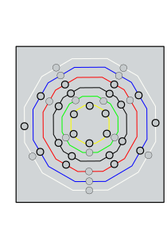

= Ideas

IDEAS Música de partículas

Visor de escalas. ScaleViewer ???

- Mostrará las doce notas "D e E F g G a A b B C d" en círculo, en este orden en sentido reloj, pero siempre en forma vertical, no girar las letras´
- Se considera que la posición inicial es la que queda en la parte inferior, y se avanza en sentido reloj.
- Solo hay doce posiciones angulares, es decir, se puede girar el círculo solo en las 12 posiciones del reloj, o sea, 30 grados cada una.
- La forma puede ser circular o bien polígonos de doce lados, para remarcar cada una de las doce posiciones
- Se puede variar el ángulo de comienzo de cada círculo por separado.
- Algunas de las notas no se mostrarán y otras sí, siguiendo un patrón distinto para cada círculo, por ejemplo, 0: mostrar, 1:no mostrar
Por ejemplo, el patrón "101101010110" representa al modo dórico de la escala diatónica. Se mostrarían solo las siete notas DEFGABC, en cambio el patrón 101001010010, representa la escala pentatónica y mostrará solamente las notas DEGAC.
- El patrón de cada círculo es fijo, y tiene un nombre. 
- Disponemos de 6 patrones: WHITE, BLUE, RED, BLACK, PENTA y TONES.
- Se mostrarán varios círculos concentricos de notas, independientes.
- Cada círculo puede mostrar un color distinto.
- Se pueden seleccionar acordes en un círculo, es decir, conjuntos de notas alternas, con una nota en medio, como CEG o FAD, desde 2 a 8 notas, para lo cual, se selecciona la posición inicial, la que está en la posición de inicio y con algún sistema se indicará que se quiere agregar una nota, que agregará la siguiente nota impar, es decir, dejando libre una nota en medio, luego otra, y otra, hasta que el usuario desee o hasta que se seleccionen todas (lo que ocurrirá al dar dos vueltas a todo el círculo)
- El usuario puede seleccionar entonces cambiar de círculo ( de escala ) usando por ejemplo flecha arriba o flecha abajo, para que el círculo contiguo se seleccione y entonces con flecha izquierda o derecha, intentará encontrar en esa escala un acorde con la misma estructura, es decir, la misma separación entre sus notas (pueden dejar dos notas en medio o tres, e incluso cuatro). Si encuentra alguno igual lo seleccionará y lo girará hasta hacerlo coincidir con el otro, es decir, pondrá la primera nota hacia abajo.
- El usuario puede rotar un círculo por huecos o por notas, es decir, puede hacer que roten las notas y se vean otras notas distintas, o que roten los huecos, o que roten ambas cosas al mismo tiempo, para intentar emparejar de alguna forma un círculo con otro.
- También se puede mover un círculo a otra posición respecto a los otros, es decir, colocarlo más hacia adentro o más hacia fuera, de forma que se puedan comparar como se desee.
- Se debe marcar de alguna forma cuál es la orientación original del círculo, para que el usuario sepa de un vistazo si está girado o no.
- Habrá una forma de resetear los círculos para que queden todos en la posición inicial
- Eventualmente, los acordes seleccionados podrán reproducir el sonido correspondiente a sus notas

